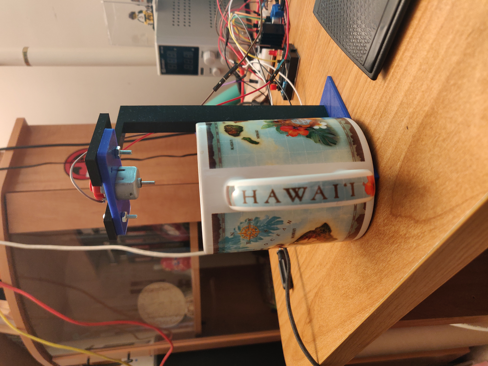

# coffee_stirrer

  

    I simply got tired of stirring my own coffee in the morning.
  

  

    So I made my own coffee stirrer. I basically 3D printed a small stand and flipped a simple
    DC motor upside down. The way you turn it on is you push a button that is connected to the Arduino Nano
    and it tells the motor controller to turn the DC motor. 
  

  
  

    Here is a small demonstration (without a cup of coffee for now) of how it works. Please disregard the last second
    of the gif when the stirrer falls off the motor as that was not supposed to happen. Pretend that it actually stayed on.
  

  
  
  
  
  

    Here is the placeholder caption of where I will put the gif of the stirrer actually stirring coffee.
  

  
  
  

    Here are some extra pictures I took of the excellent, non faulty design. 
  

  
  

